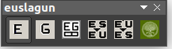

Euskaraz idazteko lagungarri den Libreoffice hedapena.
===

### Nola Instalatu

OXT luzapena duen fitxategian klik bikoitza eginez libreofficen instalatuko da.

### Itxura

### Azalpena

 1. Hautatutako testua euskaraz zuzentzen du.
 2. Hautatutako testua gazteleraz zuzentzen du.
 3. Bi zutabeko taula bat sortzen du. Ezkerrean euskaraz eta eskuinean gazteleraz zuzentzen du. Erdian tarte bat uzten du.
 4. Hitz bat hautatzen badugu itzulpena Zehazki webgunean bilatuko du. Ez baldin badugu ezer hautatu, leiho bat irekiko da eta itzuli nahi dugun hitza eskatuko digu.
 5. Hitz bat hautatzen badugu itzulpena Elhuyar webgunean bilatuko du. Ez baldin badugu ezer hautatu, leiho bat irekiko da eta itzuli nahi dugun hitza eskatuko digu.
 6. Hitz bat hautatzen badugu esanahia euskaltzaindiaren webgunean bilatuko du. Ez baldin badugu ezer hautatu, leiho bat irekiko da eta nahi dugun hitza eskatuko digu.